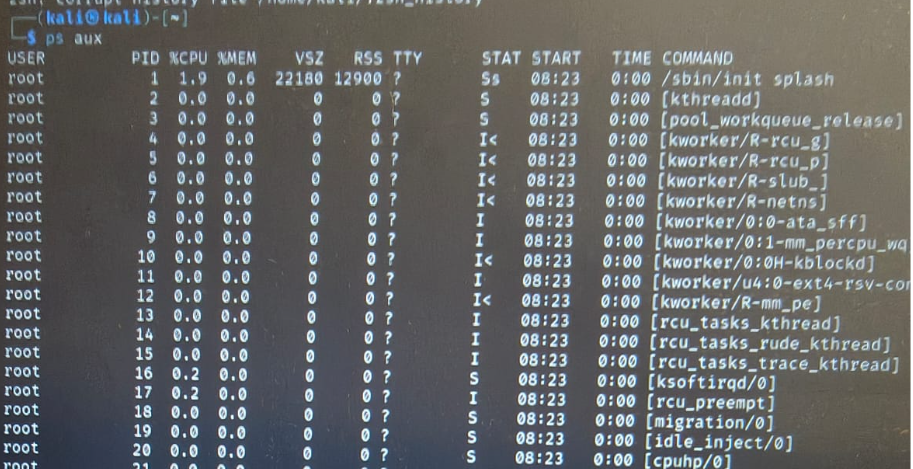
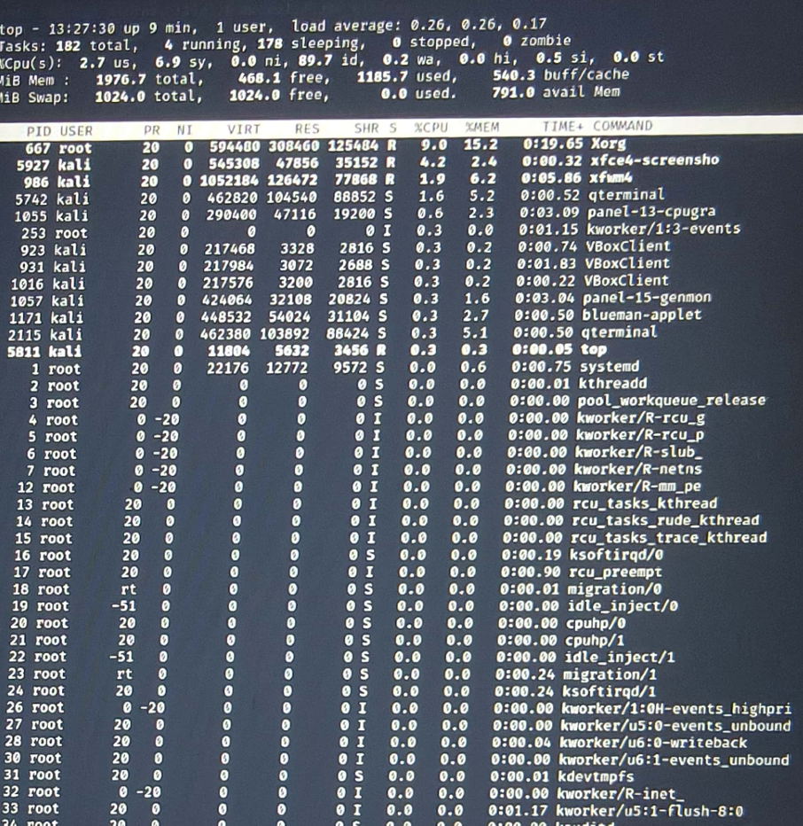
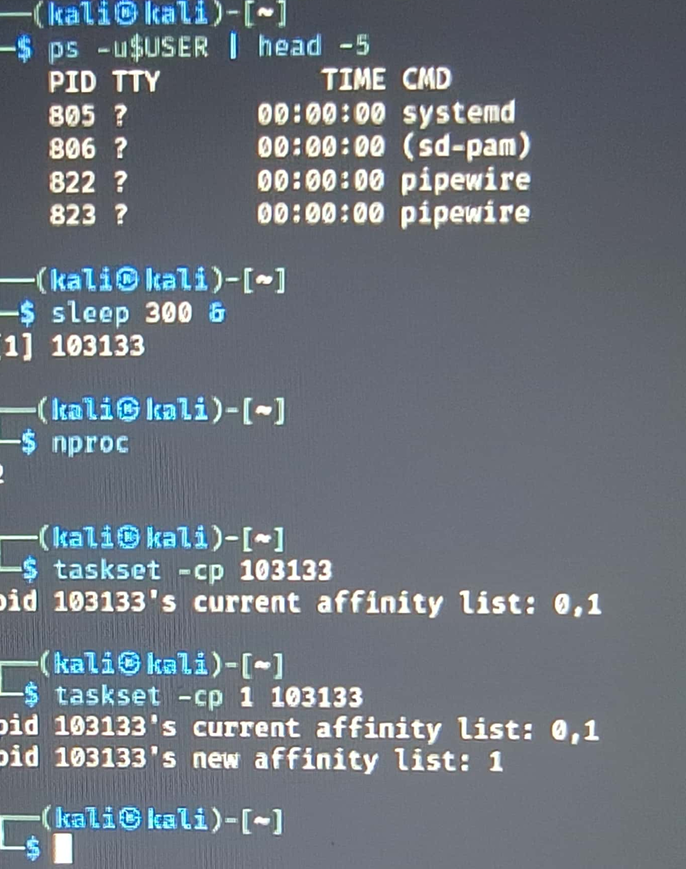
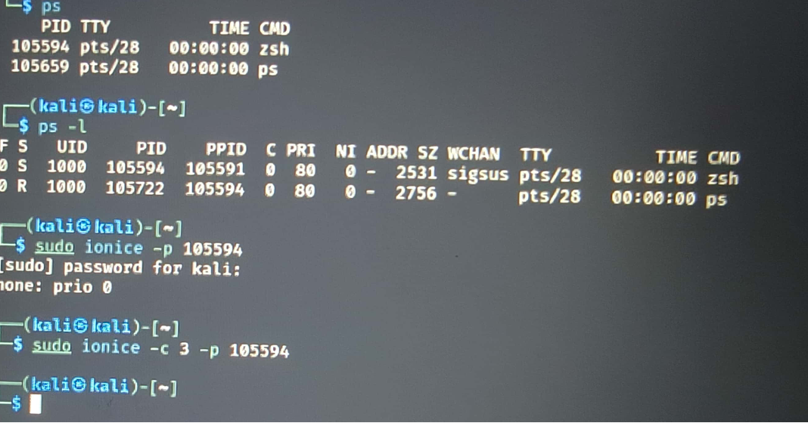
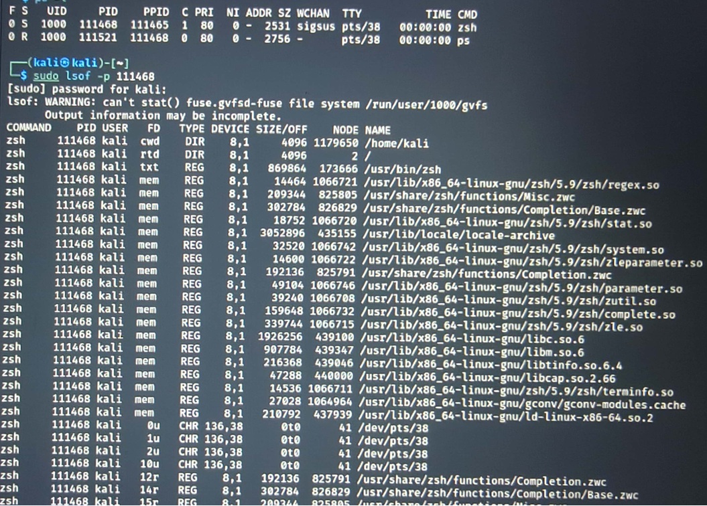
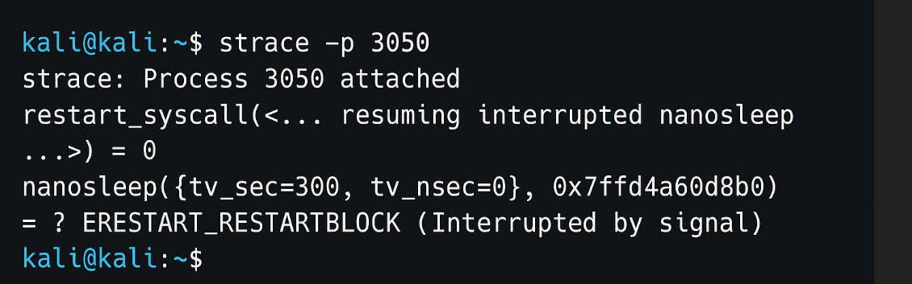
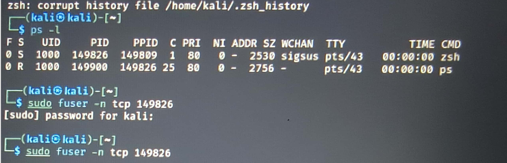
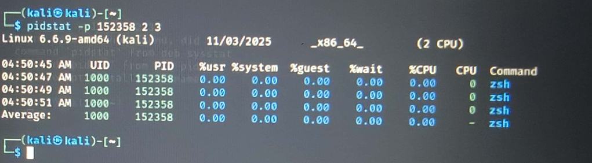
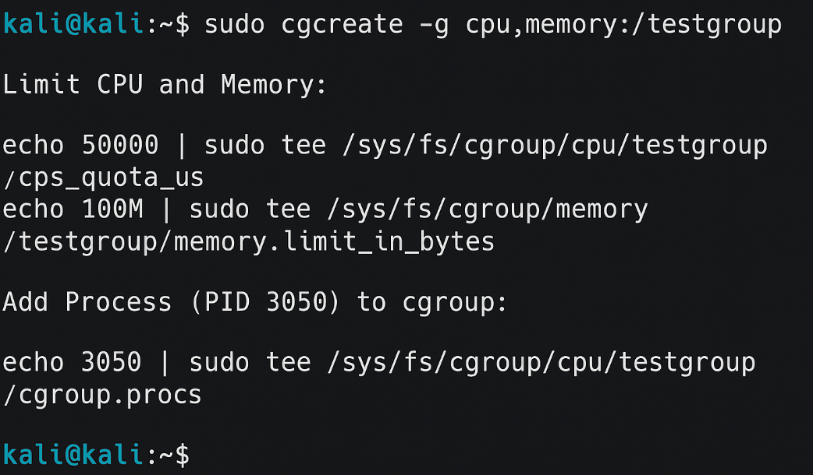
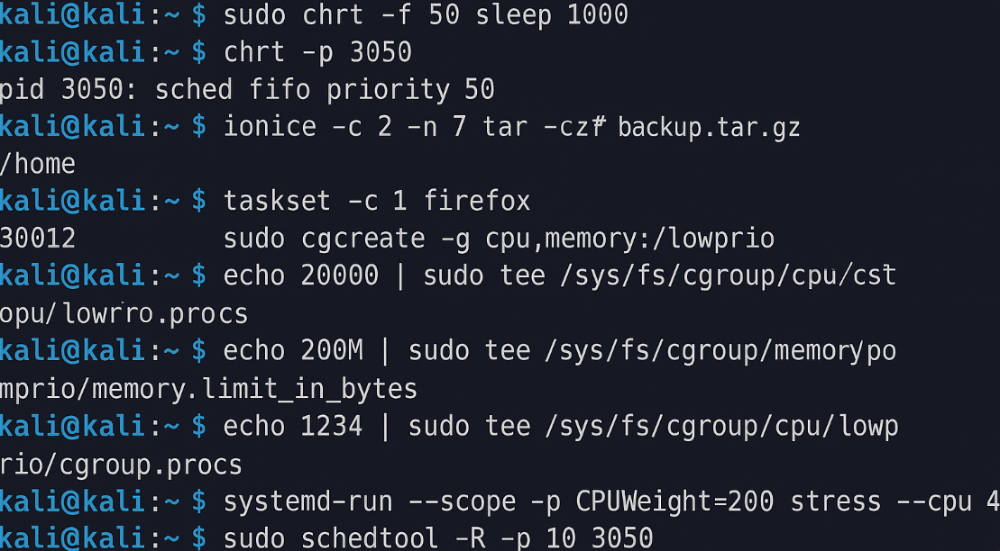

### 🔹 1. Viewing All Processes

**Command:**
`ps aux`
📸 **:** 


### 🌲 2. Process Tree
**Command:**
`pstree -p`
📸 **:** 

### 📊 3. Real-Time Process Monitoring
**Command:**
`top`
📸 **:** *


### ⚡ 4. Adjusting Process Priority
**Command 1:**
`nice -n 10 sleep 300 &`
**Command 2:**
`renice -n -5 -p 3050`
📸 **** 

---

### 🔧 5. CPU Affinity
**Command 1:**
`taskset -cp 3050`
**Command 2:**
`taskset -cp 1 3050`
📸 **** 

### 📂 6. I/O Scheduling Priority
**Command:**
`ionice -c 3 -p 3050`
📸 **** 

---

### 📑 7. File Descriptors Used by a Process
**Command:**
`lsof -p 3050 | head -5`
📸 **** 

---

### 🐛 8. Trace System Calls of a Process
**Command:**
`strace -p 3050`
📸 **:** 

---

### 📡 9. Find Process Using a Port
**Command:**
`sudo fuser -n tcp 8080`
📸 **** 

### 📊 10. Per-Process Statistics
**Command:**
`pidstat -p 3050 2 3`
📸 **** 

---

### 🔐 11. Control Groups (cgroups)
**Command Sequence:**

```bash
sudo cgcreate -g cpu,memory:/testgroup
echo 50000 | sudo tee /sys/fs/cgroup/cpu/testgroup/cpu.cfs_quota_us
echo 100M | sudo tee /sys/fs/cgroup/memory/testgroup/memory.limit_in_bytes
echo 3050 | sudo tee /sys/fs/cgroup/cpu/testgroup/cgroup.procs
```

📸 **** 

---

### 🎯 12. Alternatives to nice / renice

You can show **one example** among these for demonstration, like:
`sudo chrt -f 50 sleep 1000`
📸 **** 

---

