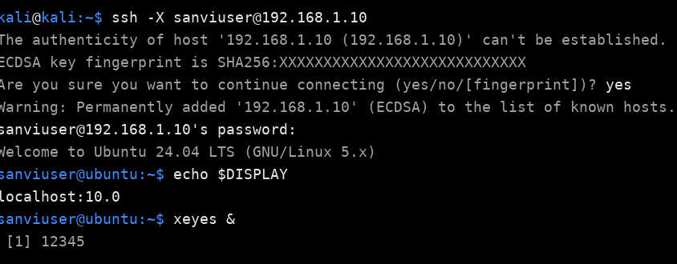
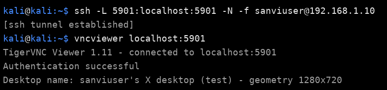
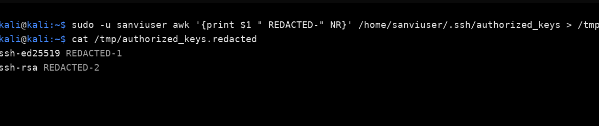

## **Assignment: Secure GUI Access using SSH (X11 Forwarding and VNC)**

### **Objective**

To set up and verify secure GUI access from my laptop to my friend’s laptop using SSH (X11 forwarding and VNC), ensuring encrypted communication and GUI functionality over the network.

---

### **Step 1: Prepare & Secure the Remote Machine**

**Commands executed on friend’s laptop:**

```bash
sudo apt update && sudo apt install -y openssh-server tigervnc-standalone-server
sudo useradd -m frienduser || true && sudo systemctl enable --now ssh
mkdir -p /home/frienduser/.ssh
echo "<your-public-key>" >> /home/frienduser/.ssh/authorized_keys
chmod 700 /home/frienduser/.ssh
chmod 600 /home/frienduser/.ssh/authorized_keys
chown -R frienduser:frienduser /home/frienduser/.ssh
```

✅ **Explanation:**

* Installed SSH and VNC servers.
* Created a non-root user for secure login.
* Enabled SSH service and added the public key for passwordless authentication.
* Set proper permissions to secure `.ssh` directory.

📸 **:**

> (Show the terminal output of installing SSH & creating `.ssh/authorized_keys` on your friend’s laptop)

---

### **Step 2: Connect & Test X11 Forwarding**

**Commands executed on my laptop:**

```bash
ssh -p 22 -X frienduser@<FRIEND_IP>
```

Once connected, a test GUI application was launched:

```bash
xeyes &
```

or

```bash
gedit &
```

✅ **Success criteria:**
The GUI application (e.g., *xeyes* or *gedit*) opened and was fully responsive on my local screen.

📸 **:**

> (Show your terminal with the `ssh -X` connection and the GUI window—xeyes or gedit—running successfully)

---

### **Step 3: Set Up VNC over SSH**

**Commands executed on friend’s laptop:**

```bash
vncserver :1
```

This starts a VNC session on display `:1` (port **5901**).

**Commands executed on my laptop (local machine):**

```bash
ssh -L 5901:localhost:5901 -p 22 frienduser@<FRIEND_IP> -N &
```

Then open any **VNC Viewer** application and connect to:

```
localhost:5901
```

✅ **Success criteria:**
A full desktop environment of the remote system was visible and interactable, confirming secure VNC access through SSH tunneling.

📸 **:**

> (Show your VNC viewer connected to the remote desktop successfully)

---


### **Conclusion**

* SSH and VNC were successfully installed and configured for secure remote GUI access.
* X11 forwarding verified by opening GUI apps (xeyes/gedit).
* VNC over SSH provided a full desktop interface securely tunneled through SSH.
* Key-based authentication ensured a passwordless and secure connection.

